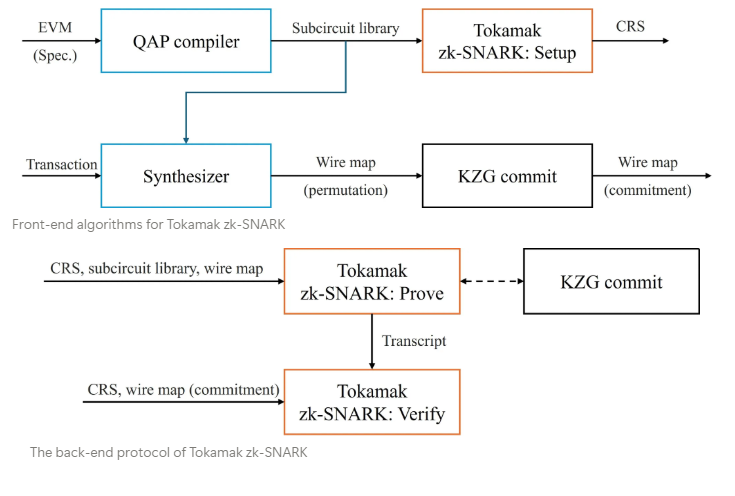

# Tokamak-zk-EVM

Tokamak-zk-EVM is a zero-knowledge Ethereum Virtual Machine implementation that enables scalable and private smart contract execution.

## Tokamak-zk-EVM flow chart


## Usage
We provide [Playground](https://github.com/tokamak-network/Tokamak-zk-EVM-playgrounds), a graphical user interface that helps you easily follow the execution of Tokamak zk-EVM.
### With Playground (in progress)
Will be updated soon.
### Without Playground
Here is an example of generating a zk proof of the correct execution of an [ERC-20 transfer transaction for the TON contract](./packages/frontend/synthesizer/examples/erc20/ton-transfer.ts).
1. Make sure that you have installed
    - [Node.js](https://nodejs.org/en),
    - [Circom](https://docs.circom.io),
    - [Rust](https://www.rust-lang.org),
    - [CMake](https://cmake.org) (+ [Docker](https://www.docker.com) would be helpful for installing and using CMAKE, if you use Windows).
3. Clone the zk-evm repository (the main branch)
    
    ```bash
    git clone https://github.com/tokamak-network/Tokamak-zk-EVM
    ```
    
4. Open the “Tokamak-zk-EVM” folder.
5. Run `qap-compiler` (requiring Node.js and Circom)
    
    ```bash
    cd "$pwd/packages/frontend/qap-compiler"
    npm install
    ./scripts/compile.sh
    ```
    
6. Run `synthesizer` (requiring Node.js)
    
    ```bash
    cd "$pwd/packages/frontend/synthesizer"
    npm install
    npx tsx ./examples/erc20/ton-transfer.ts
    ```
    
7. Run `setup` (requiring Rust and CMake)
    
    ```bash
    cd "$pwd/packages/backend"
    cargo run -p trusted-setup
    ```
    
8. Run `preprocess` (requiring Rust and CMake)
    
    ```bash
    cd "$pwd/packages/backend"
    cargo run -p preprocess
    ```
    
9. Run `prove` (requiring Rust and CMake)
    
    ```bash
    cd "$pwd/packages/backend"
    cargo run -p prove
    ```

    10. Run `verify` (requiring Rust and CMake)

    ```bash
    cd "$pwd/packages/backend"
    cargo run -p verify
    ```

    11. Run `solidity verify` (requiring Foundry and Solidity)

    ```bash
    cd "$pwd/packages/backend/verify/solidity"
    forge install
    forge test -vvvv
    ```


## Package Composition

This monorepo contains the core components of the Tokamak-zk-EVM ecosystem:

### Frontend Packages
| Package | Description | Language |
|---------|-------------|----------|
| [`qap-compiler`](./packages/frontend/qap-compiler) | Library of subcircuits for basic EVM operations | circom |
| [`synthesizer`](./packages/frontend/synthesizer) | Compiler that converts an Ethereum transaction into a circuit for Tokamak zk-SNARK | javascript |
### Backend Packages
| Package | Description | Language |
|---------|-------------|----------|
| [`libs`](./packages/backend/libs) | Mathematical and signal processing related library functions for Tokamak zk-SNARK | rust |
| [`mpc-setup`](./packages/backend/setup/mpc-setup) | Tokamak zk-SNARK's setup alogirhtm (multi-party computation version) | rust |
| [`trusted-setup`](./packages/backend/setup/trusted-setup) | Tokamak zk-SNARK's setup algorithm (trusted single entity version) | rust |
| [`prover`](./packages/backend/prove) | Tokamak zk-SNARK's proving algorithm | rust |
| [`verify`](./packages/backend/verify) | Tokamak zk-SNARK's verifying algorithm | rust, solidity |

## Package Versions
| Package | Current Version | Status |
|---------|----------------|---------|
| `qap-compiler` | v0.5.0 | 🧪 Beta |
| `synthesizer` | v0.5.0 | 🧪 Beta |
| `libs` | v0.5.0 | 🧪 Beta |
| `prove` | v0.5.0 | 🧪 Beta |
| `mpc-setup` | - | 🚧 Planned |
| `trusted-setup` | v0.5.0 | 🧪 Beta |
| `verify-rust` | v0.5.0 | 🧪 Beta |
| `verify-sol` | v0.0.1 | 🔥  Alpha |


### Version Strategy
🔥 Alpha
- Initial implementation and testing

🧪 Beta
- System-wide testing and optimization

⭐️ Stable (v1.0.0)
- Production-ready release
- Full system integration and testing

## Documentation
- [Project Tokamak zk-EVM(Medium)](https://medium.com/tokamak-network/project-tokamak-zk-evm-67483656fd21) (Last updated in Apr. 2025)
- [Project Tokamak zk-EVM(Slide)](https://docs.google.com/presentation/d/1D49fRElwkZYbEvQXB_rp5DEy22HFsabnXyeMQdNgjRw/edit?usp=sharing) (Last updated in Jul. 2025)
- [Tokamak zk-SNARK Paper](https://eprint.iacr.org/2024/507) (Last updated in Apr. 2025)
- Frontend
    - [Synthesizer](https://tokamak-network-zk-evm.gitbook.io/tokamak-network-zk-evm)
<!-- - [API Reference](./docs/api) -->

## Contributing
We welcome contributions! Please see our [Contributing Guidelines](./CONTRIBUTING.md) for details.

## License
This project is licensed under [MPL-2.0](./LICENSE).
