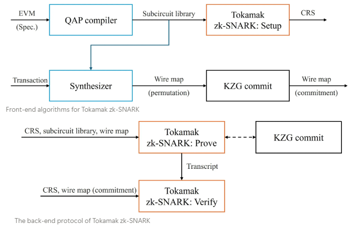

# Tokamak-zk-EVM

Tokamak zk-EVM is a tool that converts [TokamakL2JS](https://github.com/tokamak-network/TokamakL2JS) transactions into ZKPs.

[TokamakL2JS](https://github.com/tokamak-network/TokamakL2JS), which is a variant of [EthereumJS](https://github.com/ethereumjs/ethereumjs-monorepo), specifies a layer 2 protocol of Tokamak Network.

If you are interested in converting Ethereum transactions to ZKP, check out branch "[archive-airdrop-Sep25](https://github.com/tokamak-network/Tokamak-zk-EVM/tree/archive-airdrop-Sep25)" (incomplete development).

# Getting started

This section describes how to use the **main CLI** named **`tokamak-cli`**.

## Native npm installation

`@tokamak-zk-evm/cli` performs a **full local install** during `npm install`. The package does not
download prebuilt Rust backend binaries. Instead it:

1. installs `@tokamak-zk-evm/subcircuit-library` and `@tokamak-zk-evm/synthesizer-node`,
2. builds the backend Rust binaries locally on the consumer machine, and
3. downloads CRS artifacts unless setup is explicitly skipped.

Because of that, the consumer machine must already have the required local build toolchain.

### Supported native platforms

- macOS
- Linux

Native Windows is not supported for the npm package flow. Use WSL2 or the Docker flow below on Windows.

### Required tools for native npm installation

The local machine must provide all of the following before `npm install @tokamak-zk-evm/cli`:

- Node.js 20 or newer
- npm
- Rust and Cargo
- `bash`
- `cmake`
- `curl`
- `tar`
- `unzip`
- A working C/C++ build toolchain
- `pkg-config` on Linux

`npm` remains part of the minimum toolchain even after the package is installed. During the backend
release build, the Rust build scripts resolve and pack the published
`@tokamak-zk-evm/subcircuit-library` package to embed the release snapshot and metadata.

### macOS setup

1. Install Apple developer tools.
   Either of the following is acceptable:
   - `xcode-select --install`
   - a full Xcode installation with the active developer directory configured

   Example:
   ```bash
   xcode-select --install
   ```
2. Install Homebrew if it is not already installed:
   https://brew.sh/
3. Install Node.js and CMake:
   ```bash
   brew install node cmake
   ```
4. Install Rust:
   ```bash
   curl https://sh.rustup.rs -sSf | sh
   source "$HOME/.cargo/env"
   ```
5. Verify the required tools:
   ```bash
   node --version
   npm --version
   rustc --version
   cargo --version
   cmake --version
   curl --version
   tar --version
   unzip -v
   cc --version
   c++ --version
   install_name_tool -h
   ```
6. Install the CLI package:
   ```bash
   npm install -g @tokamak-zk-evm/cli
   ```

The macOS packaging path rewrites runtime library search paths with `install_name_tool`, so the
selected Apple developer tools must provide `cc`, `c++`, and `install_name_tool`.

### Linux setup

The exact package names depend on the distribution. On Ubuntu or Debian, the following is a good baseline:

1. Install the system build prerequisites:
   ```bash
   sudo apt-get update
   sudo apt-get install -y build-essential curl cmake unzip tar pkg-config bash
   ```
2. Install Node.js 20 or newer.
   - Use https://nodejs.org/ or NodeSource if the distro package is older than 20.
3. Install Rust:
   ```bash
   curl https://sh.rustup.rs -sSf | sh
   source "$HOME/.cargo/env"
   ```
4. Verify the required tools:
   ```bash
   node --version
   npm --version
   rustc --version
   cargo --version
   cmake --version
   curl --version
   tar --version
   unzip -v
   cc --version
   c++ --version
   make --version
   pkg-config --version
   ```
5. Install the CLI package:
   ```bash
   npm install -g @tokamak-zk-evm/cli
   ```

### Windows setup

Native Windows installation of `@tokamak-zk-evm/cli` is not supported.

Use one of:

- WSL2 with an Ubuntu environment, then follow the Linux setup above.
- Docker Desktop with the repository checkout flow below.

## Repository checkout and Docker

This repository checkout flow is useful for contributors or for Windows users who want an isolated environment.

### Windows users
1. Install Docker Desktop for Windows – https://docs.docker.com/desktop/install/windows-install/
2. If you want CUDA/GPU support, install the NVIDIA GPU driver and verify Docker GPU pass-through.
   - Install [the latest NVIDIA driver](https://developer.nvidia.com/cuda/wsl).
   - Ensure Docker Desktop is using Linux containers with the WSL 2 backend.
   - Optional host checks:
     ```bash
     nvidia-smi
     docker run --rm --gpus all nvidia/cuda:12.2.0-runtime-ubuntu22.04 nvidia-smi
     ```
3. Run Docker Compose from the repository root, `Tokamak-zk-EVM`.
   - CPU environment:
     ```bash
     docker compose build cli
     docker compose run --rm cli
     ```
   - GPU environment:
     ```bash
     docker compose build cli-gpu
     docker compose run --rm cli-gpu
     ```
   - Both services mount the repository to `/workspace` and start an interactive Bash shell there.

### macOS or Linux contributors

If you are running the CLI from a repository checkout instead of the npm package, you can still use the existing repo-local flow:

```bash
./tokamak-cli --install
```

For that checkout-based flow, install the same Node/Rust/CMake prerequisites listed above before the first run.

## How to run (for all platforms)

From the repository root:

1) **Install** (install published runtime packages, build backend binaries, and prepare setup artifacts)
```bash
./tokamak-cli --install
```
By default, `--install` downloads the latest compatible CRS archive from the published Google Drive
folder. Use `./tokamak-cli --install --trusted-setup` to generate CRS locally, or
`./tokamak-cli --install --no-setup` to skip setup artifact provisioning.

2) **Synthesize** (prepare inputs from one Tokamak L2 transaction snapshot)
```bash
./tokamak-cli --synthesize <INPUT_DIR>

# Or pass explicit file paths
./tokamak-cli --synthesize \
  --previous-state <PREVIOUS_STATE_SNAPSHOT_JSON> \
  --transaction <TRANSACTION_JSON> \
  --block-info <BLOCK_INFO_JSON> \
  --contract-code <CONTRACT_CODES_JSON>
```
`<INPUT_DIR>` must contain `previous_state_snapshot.json`, `transaction.json`, `block_info.json`, and `contract_codes.json`.

3) **Preprocess** (backend preprocess stage)
```bash
./tokamak-cli --preprocess
```

4) **Prove** (backend prove stage; outputs stay under `dist/<platform>/resource/prove/output`)
```bash
./tokamak-cli --prove
```

5) **Verify** (verify proof artifacts in dist; optional resource overlay path)
```bash
# Uses dist/<platform>/resource by default
./tokamak-cli --verify

# Or provide a directory containing a resource/ folder to overlay into dist before verifying
./tokamak-cli --verify <PATH_WITH_RESOURCE>
```

6) **Extract proof bundle** (optional; zip key artifacts)
```bash
./tokamak-cli --extract-proof <OUTPUT_ZIP_PATH>
```

## Disclaimer
- The Tokamak‑zk‑EVM project and its maintainers are **not responsible for any leakage or misuse of your API keys or credentials**.

## Package Composition


### Frontend Packages (compilers)

| Package                                            | Description                                                                        | Language   | Version |
| -------------------------------------------------- | ---------------------------------------------------------------------------------- | ---------- | ------- |
| [`qap-compiler`](./packages/frontend/qap-compiler) | Library of subcircuits for basic EVM operations                                    | Circom     | [`1.0.3` on npm (`@tokamak-zk-evm/subcircuit-library`)](https://www.npmjs.com/package/@tokamak-zk-evm/subcircuit-library) |
| [`synthesizer-node`](./packages/frontend/synthesizer/node-cli) | Node CLI package that converts Tokamak L2 transaction snapshots into circuit inputs | TypeScript | [`1.0.3` on npm (`@tokamak-zk-evm/synthesizer-node`)](https://www.npmjs.com/package/@tokamak-zk-evm/synthesizer-node) |
| [`synthesizer-web`](./packages/frontend/synthesizer/web-app) | Browser-facing package that converts Tokamak L2 transaction snapshots into circuit inputs | TypeScript | [`1.0.3` on npm (`@tokamak-zk-evm/synthesizer-web`)](https://www.npmjs.com/package/@tokamak-zk-evm/synthesizer-web) |

### CLI Package

| Package                     | Description                                                                                       | Language   | Version |
| --------------------------- | ------------------------------------------------------------------------------------------------- | ---------- | ------- |
| [`tokamak-cli`](./packages/cli) | npm-distributed launcher package that builds the backend locally and exposes the Tokamak CLI flow | TypeScript | [`2.0.0` on npm (`@tokamak-zk-evm/cli`)](https://www.npmjs.com/package/@tokamak-zk-evm/cli) |

### Backend Packages


| Package                                                   | Description                                                                       | Language       | Version |
| --------------------------------------------------------- | --------------------------------------------------------------------------------- | -------------- | ------- |
| [`mpc-setup`](./packages/backend/setup/mpc-setup)         | Tokamak zk-SNARK's setup algorithm (multi-party computation version)              | Rust           | [`1.0.0` on Google Drive](https://drive.google.com/drive/folders/1Xvm8mdliHJZafzE5jaPidK4xqWAM0F9A) |
| [`trusted-setup`](./packages/backend/setup/trusted-setup) | Tokamak zk-SNARK's setup algorithm (trusted single entity version)                | Rust           | `1.0.0` |
| [`prover`](./packages/backend/prove)                      | Tokamak zk-SNARK's proving algorithm                                              | Rust           | `1.0.0` |
| [`verify`](./packages/backend/verify)                     | Tokamak zk-SNARK's verifying algorithm                                            | Rust, Solidity | `1.0.0` |

## Development Status
### Sep. 2025
- Archived in branch "[archive-airdrop-Sep25](https://github.com/tokamak-network/Tokamak-zk-EVM/tree/archive-airdrop-Sep25)".
- Incomplete conversion of Ethereum transactions into ZKPs.
- What does "incomplete" mean? ZKPs only include the execution of a transaction's opcodes. Verification of input state and the transaction signature, as well as reconstruction of output state, are excluded.
- The Tokamak zk-SNARK backend is ready to use:
  - MSM and NTT are accelerated by [ICICLE APIs](https://github.com/ingonyama-zk/icicle).
  - It requires < 10GB memory.
  - A ZKP can be generated in 1-2 mins on CUDA or Apple silicon.

## Jan. 2026
- Complete conversion of Tokamak Layer 2 transactions into ZKPs, which covers:
  - Verification of transaction signatures,
  - Verification of input state,
  - Execution of transaction opcodes,
  - Reconstruction of output state.
- Compatible with [Tokamak Private App Channels](https://github.com/tokamak-network/private-app-channel-manager).

## Apr. 2026
- The current main branch.
- Performance optimizations in the Tokamak zk-SNARK backend `prove` package reduce proof generation time by at least 2x in CPU environments.
- Security patches in the `qap-compiler` package strengthen the subcircuit library.
- Compatible with the new version of [Tokamak Private App Channels](https://github.com/tokamak-network/Tokamak-zk-EVM-contracts/blob/main/README.md).


## Documentation

- [Project Tokamak Network ZKP (Medium)](https://medium.com/tokamak-network/project-tokamak-zk-evm-67483656fd21) (Last updated in Nov. 2025)
- [Project Tokamak zk-EVM(Slide)](https://docs.google.com/presentation/d/1D49fRElwkZYbEvQXB_rp5DEy22HFsabnXyeMQdNgjRw/edit?usp=sharing) (Last updated in Jul. 2025)
- [Tokamak zk-SNARK Paper](https://eprint.iacr.org/2024/507) (Last updated in Apr. 2025)
- Frontend - [Synthesizer](https://tokamak-network-zk-evm.gitbook.io/tokamak-network-zk-evm) (work in progress)
<!-- - [API Reference](./docs/api) -->

## Contributing

We welcome contributions! Please see our [Contributing Guidelines](./CONTRIBUTING.md) for details.

## License

This project is dual-licensed under:

- [MIT License](./LICENSE-MIT)
- [Apache License 2.0](./LICENSE-APACHE)

You may choose either license when using this software. This dual-licensing approach is standard in the Rust ecosystem and provides maximum compatibility with other open-source projects.
